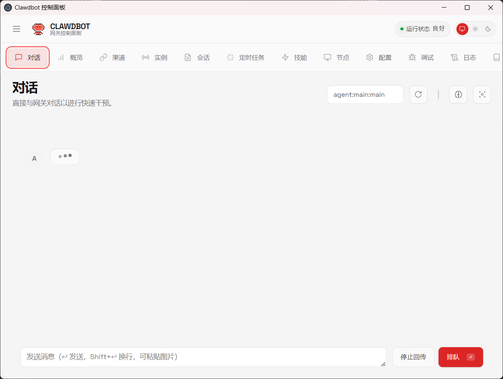
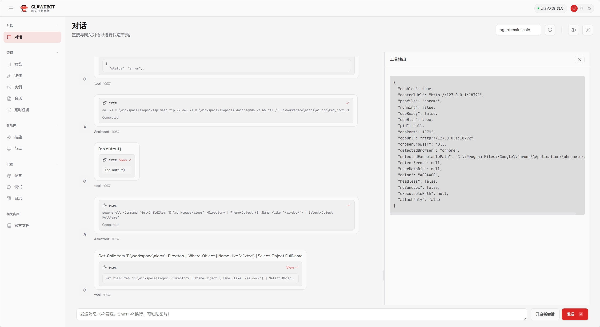

# 🦞 OpenClaw — 个人 AI 助手

桌面端：




app端：
<p align="center">
  
</p>
web端：
<p align="center">
  
</p>

<p align="center">
  <strong>EXFOLIATE! EXFOLIATE!</strong>
</p>

<p align="center">
  <a href="https://github.com/openclaw-cn/openclaw-cn/actions/workflows/ci.yml?branch=main"></a>
  <a href="https://github.com/openclaw-cn/openclaw-cn/releases"></a>
  <a href="https://deepwiki.com/openclaw-cn/openclaw-cn"></a>
  <a href="https://discord.gg/clawd"></a>
  <a href="LICENSE"></a>
</p>

**OpenClaw** 是一个你可以在自己设备上运行的*个人 AI 助手*。
它通过你常用的渠道回复你（WhatsApp、Telegram、Slack、Discord、Google Chat、Signal、iMessage、Microsoft Teams、飞书、WebChat），以及扩展渠道如 BlueBubbles、Matrix、Zalo 和 Zalo Personal。它可以在 macOS/iOS/Android 上说话和聆听，并可以渲染你控制的实时 Canvas。Gateway 只是控制平面——产品是助手。

如果你想要一个感觉本地、快速、始终在线的个人单用户助手，这就是它。现在提供 **Desktop App (Win/macOS/Linux)**，让你无需命令行即可快速开启。

[网站](https://openclaw.cn) · [文档](http://101.35.228.254/) · [入门](./docs/start/getting-started.md) · [桌面端](./docs/install/desktop.md) · [更新](./docs/install/updating.md) · [展示](./docs/start/showcase.md) · [FAQ](./docs/start/faq.md) · [向导](./docs/start/wizard.md) · [Docker](./docs/install/docker.md) · [Discord](https://discord.gg/openclaw)

首选设置：

1. **Desktop App (推荐)**：下载并运行 [OpenClaw Desktop](./docs/install/desktop.md)，这是最简单跨平台 GUI 体验，支持 **Windows、macOS 和 Linux**。
2. **CLI 向导**：运行入门向导（`openclaw onboard`）。它会引导你完成 Gateway、Workspace、Channels 和 Skills。CLI 向导推荐在 **macOS、Linux 和 Windows (通过 WSL2)** 上工作。

支持 npm、pnpm 或 bun。
新安装？从这里开始：[入门](./docs/start/getting-started.md)

**订阅（OAuth）：**

- **[Anthropic](https://www.anthropic.com/)** (Claude Pro/Max)
- **[OpenAI](https://openai.com/)** (ChatGPT/Codex)
- **[智谱 (Zhipu)](https://open.bigmodel.cn/)** (ChatGLM 4.7 / GLM-4)
- **[火山引擎 (Volcengine)](https://www.volcengine.com/)** (DeepSeek V3/R1, 豆包)

模型说明：虽然支持任何模型，但我强烈推荐 **Anthropic Pro/Max (100/200) + Opus 4.5** 用于长上下文强度和更好的提示注入抵抗。对于中文用户，**DeepSeek V3/R1 (通过火山引擎)** 和 **ChatGLM 4.7** 是极佳的选择。见 [入门](./docs/start/onboarding.md)。

## 模型（选择 + 认证）

- 模型配置 + CLI：[模型](./docs/concepts/models.md)
- 认证配置文件轮换（OAuth vs API 密钥）+ 回退：[模型故障转移](./docs/concepts/model-failover.md)

## 安装（推荐）

运行时：**Node ≥22**。

```bash
npm install -g clawdbot@latest
# 或: pnpm add -g clawdbot@latest

clawdbot onboard --install-daemon
```

向导会安装 Gateway 守护进程（launchd/systemd 用户服务），使其保持运行。

## 快速开始（TL;DR）

运行时：**Node ≥22**。

完整初学者指南（认证、配对、渠道）：[入门](https://docs.clawd.bot/start/getting-started)

```bash
clawdbot onboard --install-daemon

clawdbot gateway --port 18789 --verbose

# 发送消息
clawdbot message send --to +1234567890 --message "Hello from Clawdbot"

# 与助手对话（可选地传回任何连接的渠道：WhatsApp/Telegram/Slack/Discord/Google Chat/Signal/iMessage/BlueBubbles/Microsoft Teams/Matrix/Zalo/Zalo Personal/WebChat）
clawdbot agent --message "Ship checklist" --thinking high
```

升级？[更新指南](https://docs.clawd.bot/install/updating)（并运行 `clawdbot doctor`）。

## 开发渠道

- **stable**：标记发布（`vYYYY.M.D` 或 `vYYYY.M.D-<patch>`），npm dist-tag `latest`。
- **beta**：预发布标记（`vYYYY.M.D-beta.N`），npm dist-tag `beta`（macOS 应用可能缺失）。
- **dev**：`main` 的移动头，npm dist-tag `dev`（发布时）。

切换渠道（git + npm）：`clawdbot update --channel stable|beta|dev`。
详情：[开发渠道](./docs/install/development-channels.md)。

## 从源码（开发）

从源码构建时首选 `pnpm`。Bun 可选用于直接运行 TypeScript。

```bash
git clone https://github.com/clawdbot/clawdbot.git
cd clawdbot

pnpm install
pnpm ui:build # 首次运行时自动安装 UI 依赖
pnpm build

pnpm clawdbot onboard --install-daemon

# 开发循环（TS 更改时自动重载）
pnpm gateway:watch
```

注意：`pnpm clawdbot ...` 通过 `tsx` 直接运行 TypeScript。`pnpm build` 生成 `dist/` 用于通过 Node / 打包的 `clawdbot` 二进制运行。

## 安全默认（DM 访问）

Clawdbot 连接到真实的通讯表面。将入站 DM 视为**不受信任的输入**。

完整安全指南：[安全](./docs/gateway/security.md)

Telegram/WhatsApp/Signal/iMessage/Microsoft Teams/Discord/Google Chat/Slack 的默认行为：

- **DM 配对**（`dmPolicy="pairing"` / `channels.discord.dm.policy="pairing"` / `channels.slack.dm.policy="pairing"`）：未知发送者收到一个简短配对代码，机器人不会处理他们的消息。
- 批准：`clawdbot pairing approve <channel> <code>`（然后发送者被添加到本地允许列表存储）。
- 公共入站 DM 需要明确选择加入：设置 `dmPolicy="open"` 并在渠道允许列表中包含 `"*"`（`allowFrom` / `channels.discord.dm.allowFrom` / `channels.slack.dm.allowFrom`）。

运行 `clawdbot doctor` 以突出风险/错误配置的 DM 策略。

## 💡 核心特性

- **[本地优先 Gateway](./docs/gateway/index.md)** — 会话、渠道、工具和事件的单一控制平面。
- **中文企业级渠道支持** — **[企业微信](./docs/channels/wecom.md)** 和 **[飞书](./docs/channels/feishu.md)** 的深度集成，支持消息解密、媒体传输。
- **高性能中文模型** — 支持 **[火山引擎 (Volcengine)](./docs/providers/volcengine.md)** (DeepSeek, 豆包) 和 **[智谱 AI](./docs/providers/glm.md)**，适配中文语境下的长文本处理。
- **[多渠道收件箱](./docs/channels/index.md)** — WhatsApp、Telegram、Slack、Discord、iMessage、Signal 等。
- **[多代理路由](./docs/gateway/configuration.md)** — 将入站渠道/账户/对等方路由到隔离代理（工作区 + 每个代理会话）。
- **[语音唤醒](./docs/nodes/voicewake.md) + [对话模式](./docs/nodes/talk.md)** — macOS/iOS/Android 的始终在线语音与 ElevenLabs。
- **[实时 Canvas](./docs/platforms/mac/canvas.md)** — 代理驱动的视觉工作区与 [A2UI](./docs/platforms/mac/canvas.md#canvas-a2ui)。
- **[一流工具](./docs/tools/index.md)** — 浏览器、Canvas、节点、Cron、会话和 Discord/Slack 操作。
- **[配套应用](./docs/platforms/macos/index.md)** — macOS 菜单栏应用 + iOS/Android [节点](./docs/nodes/index.md)。
- **[入门](./docs/start/wizard.md) + [技能](./docs/tools/skills.md)** — 向导驱动设置与捆绑/管理/工作区技能。

## 星标历史

[](https://www.star-history.com/#clawdbot/clawdbot&type=date&legend=top-left)

## 我们迄今为止构建的一切

### 核心平台

- [Gateway WS 控制平面](./docs/gateway/index.md) 与会话、存在、配置、Cron、Webhook、[控制 UI](./docs/web/index.md) 和 [Canvas 主机](./docs/platforms/mac/canvas.md#canvas-a2ui)。
- [CLI 表面](./docs/tools/agent-send.md)：Gateway、代理、发送、[向导](./docs/start/wizard.md) 和 [医生](./docs/gateway/doctor.md)。
- [Pi 代理运行时](./docs/concepts/agent.md) 在 RPC 模式下与工具流和块流。
- [会话模型](./docs/concepts/session.md)：`main` 用于直接聊天、组隔离、激活模式、队列模式、回复。组规则：[组](./docs/concepts/groups.md)。
- [媒体管道](./docs/nodes/images.md)：图像/音频/视频、转录钩子、大小上限、临时文件生命周期。音频详情：[音频](./docs/nodes/audio.md)。

### 渠道

- [渠道](./docs/channels/index.md)：[WhatsApp](./docs/channels/whatsapp.md) (Baileys)、[Telegram](./docs/channels/telegram.md) (grammY)、[Slack](./docs/channels/slack.md) (Bolt)、[Discord](./docs/channels/discord.md) (discord.js)、[Google Chat](./docs/channels/googlechat.md) (Chat API)、[Signal](./docs/channels/signal.md) (signal-cli)、[iMessage](./docs/channels/imessage.md) (imsg)、[飞书](./docs/channels/feishu.md) (Lark SDK)、[企业微信](./docs/channels/wecom.md) (WeCom)、[BlueBubbles](./docs/channels/bluebubbles.md) (扩展)、[Microsoft Teams](./docs/channels/msteams.md) (扩展)、[Matrix](./docs/channels/matrix.md) (扩展)、[Zalo](./docs/channels/zalo.md) (扩展)、[Zalo Personal](./docs/channels/zalouser.md) (扩展)、[WebChat](./docs/web/webchat.md)。

### 节点

- [节点](./docs/nodes/index.md)：[macOS](./docs/platforms/mac/index.md) (菜单栏应?)、[iOS](./docs/platforms/ios/index.md) (节点应用)、[Android](./docs/platforms/android/index.md) (节点应用)、[Pi](./docs/nodes/pi.md) (Raspberry Pi)、[语音唤醒](./docs/nodes/voicewake.md)、[对话](./docs/nodes/talk.md)、[图像](./docs/nodes/images.md)、[音频](./docs/nodes/audio.md)、[视频](./docs/nodes/video.md)、[浏览器](./docs/nodes/browser.md)、[Canvas](./docs/platforms/mac/canvas.md)。

### 工具

- [工具](./docs/tools/index.md)：[代理发送](./docs/tools/agent-send.md)、[浏览器](./docs/tools/browser.md)、[Canvas](./docs/tools/canvas.md)、[Cron](./docs/tools/cron.md)、[会话](./docs/tools/sessions.md)、[Discord 操作](./docs/tools/discord.md)、[Slack 操作](./docs/tools/slack.md)、[技能](./docs/tools/skills.md)。

### 平台

- [平台](./docs/platforms/index.md)：[macOS](./docs/platforms/mac/index.md) (菜单栏应用 + Canvas)、[iOS](./docs/platforms/ios/index.md) (节点应用)、[Android](./docs/platforms/android/index.md) (节点应用)、[Web](./docs/web/index.md) (控制 UI + WebChat)、[Docker](./docs/install/docker.md)、[Nix](https://github.com/clawdbot/nix-clawdbot)。

### 概念

- [概念](./docs/concepts/index.md)：[代理](./docs/concepts/agent.md)、[会话](./docs/concepts/session.md)、[组](./docs/concepts/groups.md)、[模型](./docs/concepts/models.md)、[模型故障转移](./docs/concepts/model-failover.md)、[工具](./docs/concepts/tools.md)、[技能](./docs/concepts/skills.md)。

### 调试

- [调试](./docs/debugging.md)：[日志](./docs/logging.md)、[诊断](./docs/diagnostics.md)、[医生](./docs/gateway/doctor.md)、[测试](./docs/testing.md)。

### 安装

- [安装](./docs/install/index.md)：[入门](./docs/start/getting-started.md)、[向导](./docs/start/wizard.md)、[更新](./docs/install/updating.md)、[开发渠道](./docs/install/development-channels.md)、[Docker](./docs/install/docker.md)、[Nix](https://github.com/clawdbot/nix-clawdbot)。

### 入门

- [入门](./docs/start/index.md)：[入门](./docs/start/getting-started.md)、[向导](./docs/start/wizard.md)、[展示](./docs/start/showcase.md)、[FAQ](./docs/start/faq.md)。

## 贡献与社区

查看 `CONTRIBUTING.md` 获取贡献指南与提交 PR 的方式。

特别感谢所有贡献者与社区支持。

---

*Clawdbot 是一个开源项目。*
