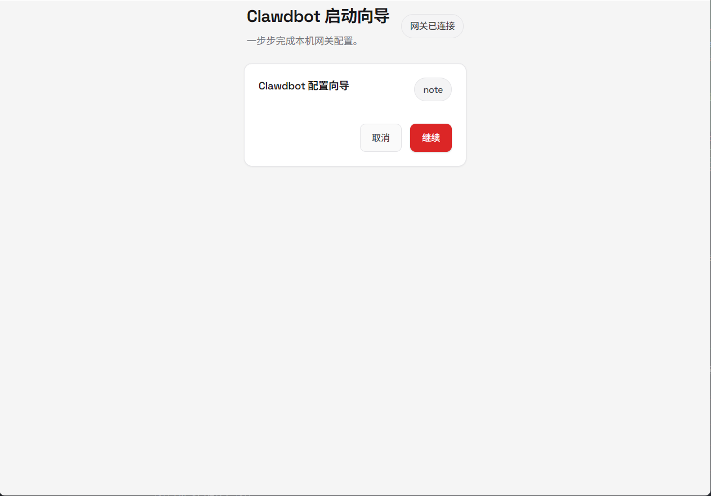
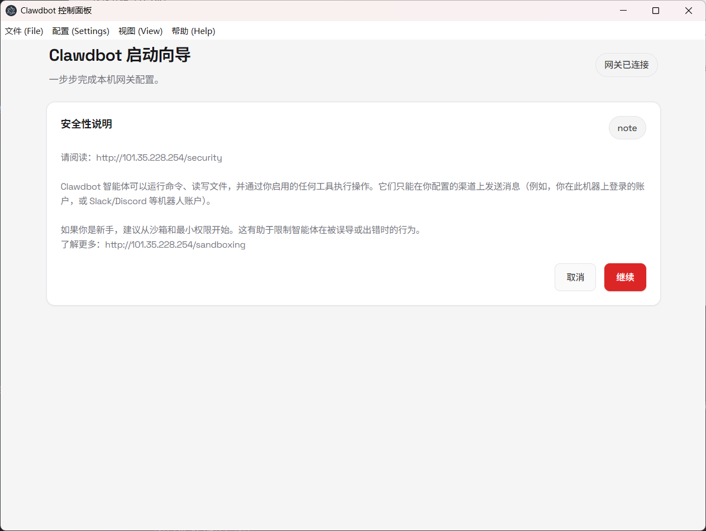
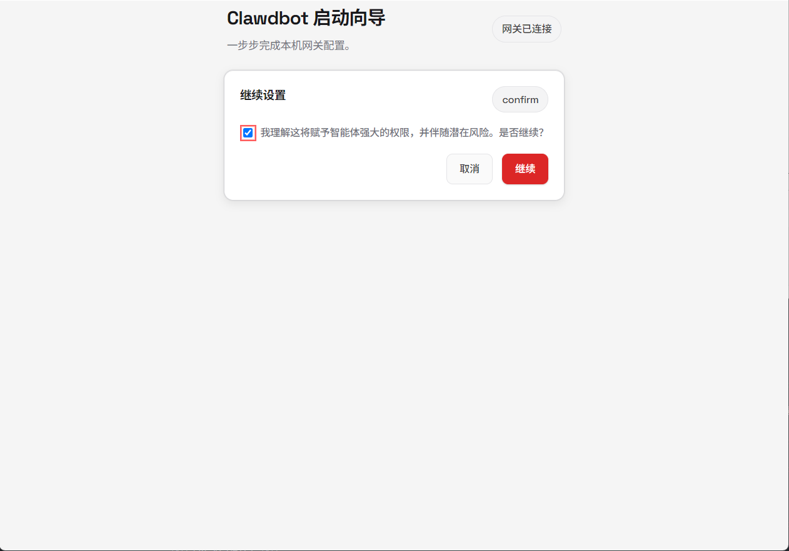
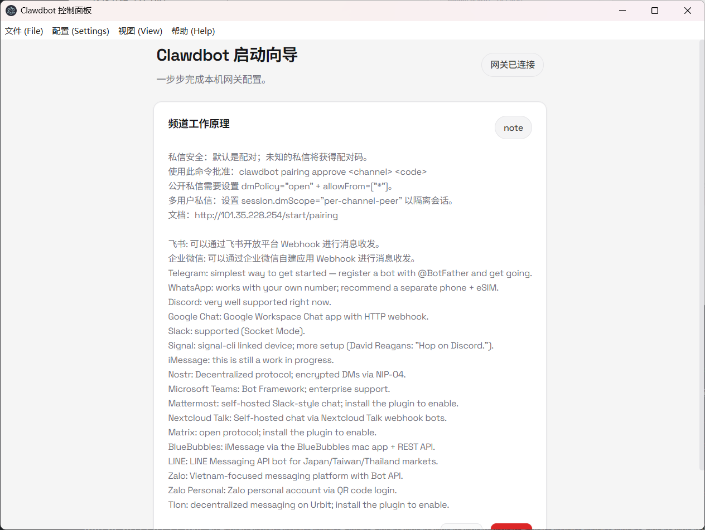
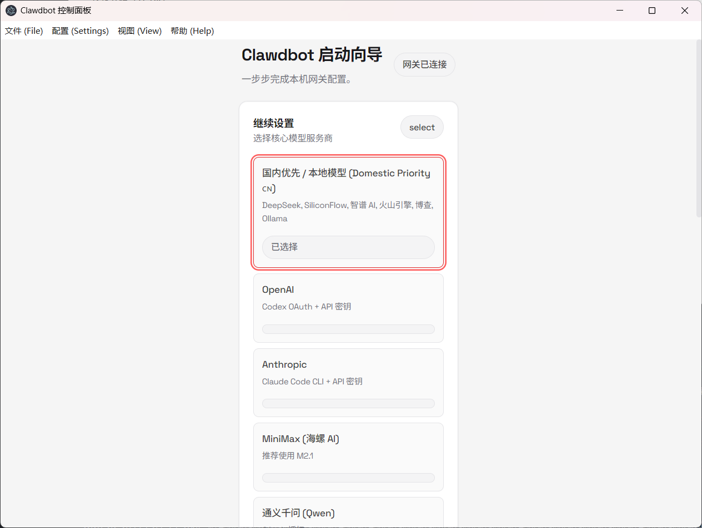

# OpenClaw Desktop

OpenClaw Desktop 是 OpenClaw 的图形化桌面客户端，支持 Windows、macOS 和 Linux。它内置了 OpenClaw Gateway，提供了一键式的 AI 助手启动体验。


桌面端：











## 核心配置与工作原理

### 1. 资产准备 (Assets Preparation)

在构建或开发模式下，应用会自动运行 `scripts/prepare-assets.cjs`。该脚本负责将必要的核心代码、扩展插件和控制界面同步到开发目录：

- `src/` -> `out/`
- `extensions/` -> `extensions/`
- `ui/dist/` -> `control-ui/`
- `dist/` (Core) -> `core/`

### 2. 文档同步 (Docs Syncing)

由于 Gateway 启动需要特定的文档模板（如 `AGENTS.md`），`scripts/copy-docs-to-out.cjs` 会将根目录的文档和配置模板复制到应用运行目录。

### 3. Gateway 启动逻辑

桌面端通过 Electron 的主进程直接启动 Gateway 进程：

- **单实例运行**：为了防止端口冲突和状态混乱，程序采用了单实例锁定机制。如果您尝试启动多个实例，程序会自动聚焦到已运行的窗口。
- **自动认证**：应用会自动读取 `~/.openclaw.json` 中的 `gateway.auth.token`，并通过 `--token` 参数传递给 Gateway 进程，确保 UI 和服务端鉴权一致。
- **端口管理**：默认使用端口 `18789`。如果端口被占用，建议先通过任务管理器或终端（`netstat -ano | findstr :18789`）清理残留进程。
- **日志查看**：Gateway 的运行日志保存在用户的 AppData 目录中（例如 `~\AppData\Roaming\openclaw-desktop\gateway.log`）。

## 开发与构建

### 安装依赖

在项目根目录运行：

```bash
pnpm install
```

### 开发模式

```bash
cd apps/desktop
pnpm dev
```

### 构建安装包 (Windows)

```bash
cd apps/desktop
pnpm run build:win
```

构建产物将存放在 `apps/desktop/dist` 目录下。

## 常见问题排查 (FAQ)

- **Gateway 无法启动 (端口占用)**：
  如果提示端口 `18789` 已被占用，请确保没有其他 OpenClaw 实例正在运行。可以使用命令 `pkill -9 -f openclaw` (Linux/macOS) 或在 Windows 上使用 `Stop-Process` 清理。
- **401 Unauthorized (Token 匹配失败)**：
  桌面版会自动同步 Token。如果手动修改过配置文件，请重启应用以重新完成握手。
- **缺少核心组件/模块**：
  请确保已在根目录执行过 `pnpm build`，以生成最新的核心静态资源。
