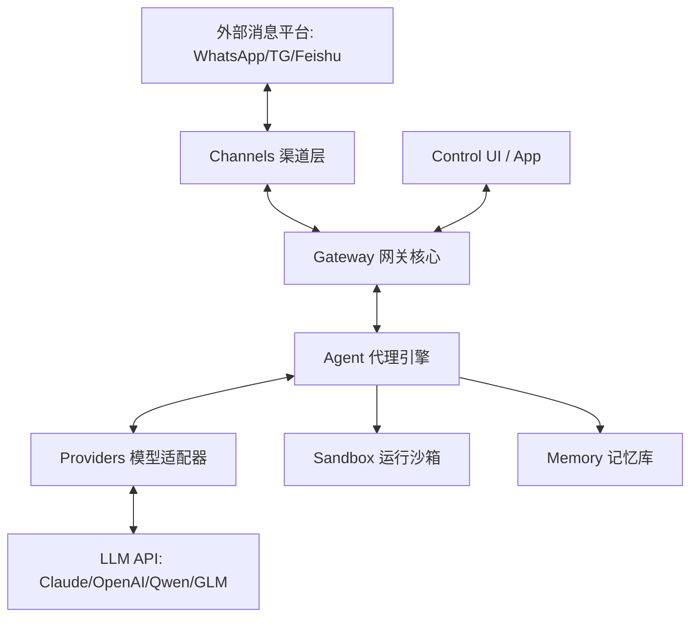
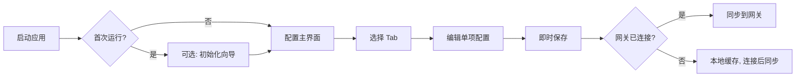

# Clawdbot Architecture Design Document

This document details the system architecture, core components, and interaction processes of Clawdbot.

## 1. Core Architecture Diagram (Logical View)

Clawdbot adopts a layered and decoupled architecture, ensuring flexibility in message channels and AI logic.

## 2. 核心组件详解

### 2.1 Gateway（网关层） - `src/gateway`
网关是整个系统的中枢（Main Hub），主要职责包括：
- **连接管理**：维护与前端 UI 及原生 App 的 WebSocket 长连接。
- **协议转换**：将各平台的私有消息格式统一转化为 Clawdbot 内部协议。
- **HTTP 接口**：提供 OpenAI 兼容的 `/v1/chat/completions` 接口。

### 2.2 Agent Engine（代理引擎） - `src/agents`
负责复杂的任务编排，包括工具调用（Sandbox）和记忆检索（Memory）。它通过 `pi-agent-core` 驱动。

### 2.3 Channels（渠道插件） - `src/channels`
采用插件化设计。
- **核心渠道**：已内置 WhatsApp、Telegram、Discord、Slack。
- **扩展性**：支持通过 `extensions/` 目录动态增加如蓝泡 (BlueBubbles)、飞书等渠道。

### 2.4 Providers（模型提供商） - `src/providers` & `src/agents/models-config.providers.ts`
支持多厂商模型接入，已适配：
- **国际**：Anthropic, OpenAI, AWS Bedrock, GitHub Copilot.
- **国内**：智谱 (GLM), 通义千问 (Qwen/DashScope), Moonshot (Kimi), Minimax, DeepSeek, 火山引擎, 硅基流动, LMStudio.

---

## 3. 配置系统架构（Configuration System）

### 3.1 设计目标
- **模块化配置**：每个配置区域（模型、渠道、工具等）独立编辑保存
- **非强制向导**：初始化向导可选，用户可直接进入配置页面按需修改
- **离线可编辑**：未连接网关时可预览/编辑配置（连接后同步）
- **即时保存**：单项配置修改后立即保存，无需批量提交

### 3.2 配置界面架构（Tab 标签页风格）

```
┌─────────────────────────────────────────────────────────────┐
│  [模型配置] [渠道配置] [工具配置] [高级设置]                    │
├─────────────────────────────────────────────────────────────┤
│                                                             │
│  ┌──────────────────┐  ┌──────────────────┐                │
│  │ 🇨🇳 国内模型      │  │ 🌍 国际模型      │                │
│  ├──────────────────┤  ├──────────────────┤                │
│  │ ○ DeepSeek      │  │ ○ OpenAI        │                │
│  │ ○ 通义千问       │  │ ○ Anthropic     │                │
│  │ ○ 智谱 GLM      │  │ ○ Google        │                │
│  │ ○ Moonshot/Kimi │  │ ○ GitHub Copilot│                │
│  │ ○ 火山引擎       │  │ ○ AWS Bedrock   │                │
│  │ ○ 硅基流动       │  │                 │                │
│  │ ○ LMStudio      │  │                 │                │
│  └──────────────────┘  └──────────────────┘                │
│                                                             │
│  [配置选中的模型...]                                         │
│                                                             │
└─────────────────────────────────────────────────────────────┘
```

### 3.3 模型配置分类

#### 国内模型（China Region）
| 模型平台 | Provider ID | API 基础 URL | 认证方式 |
|---------|-------------|--------------|---------|
| DeepSeek | `deepseek` | `https://api.deepseek.com` | API Key |
| 通义千问 | `dashscope` | `https://dashscope.aliyuncs.com/compatible-mode/v1` | API Key / OAuth |
| 智谱 GLM | `zhipu` | `https://open.bigmodel.cn/api/paas/v4` | API Key |
| Moonshot/Kimi | `moonshot` | `https://api.moonshot.cn/v1` | API Key |
| 火山引擎 | `volcengine` | `https://ark.cn-beijing.volces.com/api/v3` | API Key |
| 硅基流动 | `siliconflow` | `https://api.siliconflow.cn/v1` | API Key |
| LMStudio | `lmstudio` | `http://127.0.0.1:1234/v1` | 无需认证 |

#### 国际模型（International）
| 模型平台 | Provider ID | 认证方式 |
|---------|-------------|---------|
| OpenAI | `openai` | API Key |
| Anthropic | `anthropic` | API Key |
| Google Gemini | `google` | OAuth / API Key |
| GitHub Copilot | `copilot` | OAuth |
| AWS Bedrock | `bedrock` | IAM Credentials |

### 3.4 工具服务替代方案（中国区）

| 类别 | 国际服务 | 国内替代 | 状态 |
|------|---------|---------|------|
| 搜索 | Google/Bing | Bocha Search | ✅ 已支持 |
| TTS 语音 | OpenAI TTS | 阿里云 TTS / 讯飞 TTS | 🔜 计划中 |
| 图像生成 | DALL-E | 通义万相 / 智谱 CogView | 🔜 计划中 |
| 代码执行 | - | 本地 Sandbox | ✅ 已支持 |

### 3.5 关键文件路径

```
src/
├── commands/
│   ├── onboard-auth.models.ts    # 模型定义常量（MODEL_PROVIDERS）
│   ├── auth-choice-options.ts    # 认证选项列表
│   └── onboard-*.ts              # Onboarding 流程
├── agents/
│   └── models-config.providers.ts # Provider 配置构建
├── providers/
│   ├── deepseek.ts               # DeepSeek 适配器
│   ├── zhipu.ts                  # 智谱 GLM 适配器
│   ├── dashscope.ts              # 通义千问适配器
│   ├── moonshot.ts               # Moonshot/Kimi 适配器
│   ├── volcengine.ts             # 火山引擎适配器 [待添加]
│   ├── siliconflow.ts            # 硅基流动适配器 [待添加]
│   └── lmstudio.ts               # LMStudio 适配器 [待添加]
└── config/
    └── schema.ts                 # 配置 Schema 定义

apps/desktop/
└── src/
    ├── views/
    │   └── ConfigurationView.swift    # 配置主视图 (Tab 布局)
    └── components/
        ├── ModelConfigTab.swift       # 模型配置 Tab
        ├── ChannelConfigTab.swift     # 渠道配置 Tab
        └── ToolConfigTab.swift        # 工具配置 Tab
```

### 3.6 配置流程



### 3.7 开发任务清单

- [x] **Phase 1: 核心重构** ✅ 完成
  - [x] 重构 `onboard-auth.models.ts`，添加国内模型常量
  - [x] 添加火山引擎、硅基流动、LMStudio Provider
  - [x] 统一 Provider 配置构建接口

- [x] **Phase 2: UI 重构** ✅ 完成
  - [x] 桌面端配置页面改为 Tab 布局
  - [x] 模型配置页面分国内/国际两栏
  - [x] 实现单项即时保存

- [x] **Phase 3: 中国区工具** ✅ 完成
  - [x] 集成阿里云 TTS (`src/tts/tts.ts`)
  - [x] 集成通义万相图像生成 (`skills/tongyi-wanxiang/`)
  - [x] 完善 Bocha Search 配置
