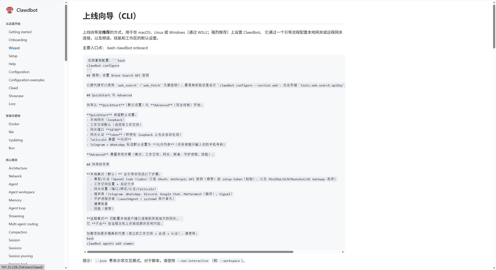
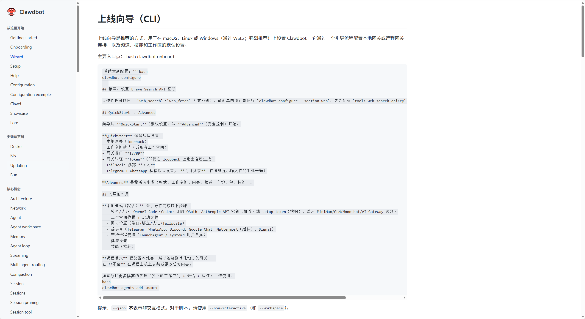

# 文档中心

使用这些中心来发现每一页内容，包括不显示在左侧导航栏中的深入分析和参考文档。

## 从这里开始

- [索引](/)
- [入门指南](/start/getting-started.md)
- [入门](/start/onboarding.md)
- [向导](/start/wizard.md)
- [设置](/start/setup.md)
- [仪表板（本地网关）](http://127.0.0.1:18789/)
- [帮助](/help/index.md)
- [配置](/gateway/configuration.md)
- [配置示例](/gateway/configuration-examples.md)
- [Clawdbot 助手（Clawd）](/start/clawd.md)
- [展示](/start/showcase.md)
- [背景故事](/start/lore.md)

## 安装与更新

- [Docker](/install/docker.md)
- [Nix](/install/nix.md)
- [更新 / 回滚](/install/updating.md)
- [Bun 工作流（实验性）](/install/bun.md)

## 核心概念

- [架构](/concepts/architecture.md)
- [网络中心](/network.md)
- [代理运行时](/concepts/agent.md)
- [代理工作区](/concepts/agent-workspace.md)
- [内存](/concepts/memory.md)
- [代理循环](/concepts/agent-loop.md)
- [流式传输 + 分块](/concepts/streaming.md)
- [多代理路由](/concepts/multi-agent.md)
- [压缩](/concepts/compaction.md)
- [会话](/concepts/session.md)
- [会话（别名）](/concepts/sessions.md)
- [会话清理](/concepts/session-pruning.md)
- [会话工具](/concepts/session-tool.md)
- [队列](/concepts/queue.md)
- [斜杠命令](/tools/slash-commands.md)
- [RPC 适配器](/reference/rpc.md)
- [TypeBox 模式](/concepts/typebox.md)
- [时区处理](/concepts/timezone.md)
- [存在状态](/concepts/presence.md)
- [发现 + 传输](/gateway/discovery.md)
- [Bonjour](/gateway/bonjour.md)
- [频道路由](/concepts/channel-routing.md)
- [组](/concepts/groups.md)
- [组消息](/concepts/group-messages.md)
- [模型故障转移](/concepts/model-failover.md)
- [OAuth](/concepts/oauth.md)

## 提供商 + 入站通道

- [聊天频道中心](/channels/index.md)
- [模型提供商中心](/providers/models.md)
- [WhatsApp](/channels/whatsapp.md)
- [Telegram](/channels/telegram.md)
- [Telegram（grammY 说明）](/channels/grammy.md)
- [Slack](/channels/slack.md)
- [Discord](/channels/discord.md)
- [Mattermost](/channels/mattermost.md)（插件）
- [Signal](/channels/signal.md)
- [iMessage](/channels/imessage.md)
- [位置解析](/channels/location.md)
- [WebChat](/web/webchat.md)
- [Webhook](/automation/webhook.md)
- [Gmail Pub/Sub](/automation/gmail-pubsub.md)

## 网关 + 运维

- [网关操作手册](/gateway/index.md)
- [网关配对](/gateway/pairing.md)
- [网关锁定](/gateway/gateway-lock.md)
- [后台进程](/gateway/background-process.md)
- [健康状态](/gateway/health.md)
- [心跳](/gateway/heartbeat.md)
- [诊断](/gateway/doctor.md)
- [日志](/gateway/logging.md)
- [沙箱](/gateway/sandboxing.md)
- [仪表板](/web/dashboard.md)
- [控制界面](/web/control-ui.md)
- [远程访问](/gateway/remote.md)
- [远程网关 README](/gateway/remote-gateway-readme.md)
- [Tailscale](/gateway/tailscale.md)
- [安全性](/gateway/security.md)
- [故障排除](/gateway/troubleshooting.md)

## 工具 + 自动化

- [工具概览](/tools/index.md)
- [OpenProse](/prose.md)
- [CLI参考](/cli/index.md)
- [执行工具](/tools/exec.md)
- [提升模式](/tools/elevated.md)
- [定时任务](/automation/cron-jobs.md)
- [定时任务 vs 心跳](/automation/cron-vs-heartbeat.md)
- [思考 + 详细模式](/tools/thinking.md)
- [模型](/concepts/models.md)
- [子代理](/tools/subagents.md)
- [代理发送CLI](/tools/agent-send.md)
- [终端UI](/tui.md)
- [浏览器控制](/tools/browser.md)
- [浏览器（Linux故障排除）](/tools/browser-linux-troubleshooting.md)
- [轮询](/automation/poll.md)

## 节点、媒体、语音

- [节点概览](/nodes/index.md)
- [摄像头](/nodes/camera.md)
- [图像](/nodes/images.md)
- [音频](/nodes/audio.md)
- [位置命令](/nodes/location-command.md)
- [语音唤醒](/nodes/voicewake.md)
- [说话模式](/nodes/talk.md)

- [平台概览](/platforms/index.md)
- [macOS](/platforms/macos.md)
- [iOS](/platforms/ios.md)
- [Android](/platforms/android.md)
- [Windows (WSL2)](/platforms/windows.md)
- [Linux](/platforms/linux.md)
- [网页界面](/web/index.md)

## macOS配套应用（高级）

- [macOS开发环境设置](/platforms/mac/dev-setup.md)
- [macOS菜单栏](/platforms/mac/menu-bar.md)
- [macOS语音唤醒](/platforms/mac/voicewake.md)
- [macOS语音覆盖](/platforms/mac/voice-overlay.md)
- [macOS WebChat](/platforms/mac/webchat.md)
- [macOS Canvas](/platforms/mac/canvas.md)
- [macOS子进程](/platforms/mac/child-process.md)
- [macOS健康](/platforms/mac/health.md)
- [macOS图标](/platforms/mac/icon.md)
- [macOS日志](/platforms/mac/logging.md)
- [macOS权限](/platforms/mac/permissions.md)
- [macOS远程](/platforms/mac/remote.md)
- [macOS签名](/platforms/mac/signing.md)
- [macOS发布](/platforms/mac/release.md)
- [macOS网关（launchd）](/platforms/mac/bundled-gateway.md)
- [macOS XPC](/platforms/mac/xpc.md)
- [macOS技能](/platforms/mac/skills.md)
- [macOS Peekaboo](/platforms/mac/peekaboo.md)

## 工作区 + 模板

- [技能](/tools/skills.md)
- [ClawdHub](/tools/clawdhub.md)
- [技能配置](/tools/skills-config.md)
- [默认AGENTS](/reference/AGENTS.default.md)
- [模板: AGENTS](/reference/templates/AGENTS.md)
- [模板: BOOTSTRAP](/reference/templates/BOOTSTRAP.md)
- [模板: HEARTBEAT](/reference/templates/HEARTBEAT.md)
- [模板: IDENTITY](/reference/templates/IDENTITY.md)
- [模板: SOUL](/reference/templates/SOUL.md)
- [模板: TOOLS](/reference/templates/TOOLS.md)
- [模板: USER](/reference/templates/USER.md)

## 实验（探索性）

- [入门配置协议](/experiments/onboarding-config-protocol.md)
- [定时任务加固笔记](/experiments/plans/cron-add-hardening.md)
- [组策略加固笔记](/experiments/plans/group-policy-hardening.md)
- [研究：内存](/experiments/research/memory.md)
- [模型配置探索](/experiments/proposals/model-config.md)

## 测试 + 发布

- [测试](/reference/test.md)
- [发布检查清单](/reference/RELEASING.md)
- [设备型号](/reference/device-models.md)